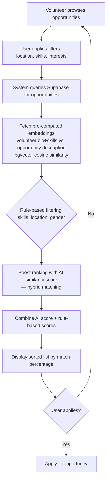

# AI-Powered Matching Engine

[← Back to README](../README.md)

---

The Intelligent Opportunity Matching feature automatically recommends and ranks volunteering opportunities for each volunteer, combining **rule-based constraints** with **AI-based semantic analysis**. Rather than relying on a single criterion, the system evaluates multiple dimensions of compatibility so that recommendations are both objective and personally relevant.

All calculations run as **PostgreSQL stored functions**, executed at the database level for performance, consistency, and scalability.

---

## Matching Pipeline



1. Retrieve volunteer data (skills, gender, location, embeddings)
2. Retrieve opportunity data (required skills, location, target audience, description embedding)
3. Compute individual matching scores using predefined mathematical formulas
4. Normalize all scores to percentage values (0–100)
5. Combine scores using weighted aggregation to produce the final ranking score

---

## 1. Skills Matching

Compares the set of skills required by an opportunity against the set of skills the volunteer possesses.

```
Skills Match (%) = (Number of Matching Skills / Total Required Skills) × 100
```

**Example:** an opportunity requires 4 skills, and the volunteer has 2 of them → `2 / 4 × 100 = 50%`

```sql
WITH skills_scores AS (
  SELECT
    os.opportunity_id,
    COUNT(*)::NUMERIC / NULLIF(COUNT(DISTINCT os.skill_id)::NUMERIC, 0) * 100 AS score
  FROM opportunity_skills os
  WHERE os.skill_id IN (
    SELECT vs.skill_id
    FROM volunteer_skills vs
    WHERE vs.volunteer_id = p_volunteer_id
  )
  GROUP BY os.opportunity_id
)
```

---

## 2. Location Matching

Evaluates physical accessibility.

- **Remote rule:** if an opportunity is marked *remote*, the location score is immediately set to **100%**.
- **Distance calculation:** the **Haversine formula** computes the great-circle distance between volunteer and opportunity coordinates:

```
Distance (km) = 6371 × arccos(
    cos(lat_v) · cos(lat_o) · cos(lon_o − lon_v) + sin(lat_v) · sin(lat_o)
)
```

- **Distance-to-score mapping:**

| Distance | Score |
|---|---|
| ≤ 10 km | 100% |
| ≤ 20 km | 90% |
| ≤ 50 km | 70% |
| ≤ 100 km | 50% |
| ≤ 200 km | 30% |
| > 200 km | 0% |

```sql
distance_calc AS (
  SELECT
    o.id AS opportunity_id,
    CASE
      WHEN o.is_remote = TRUE THEN NULL
      WHEN v_volunteer.latitude IS NULL OR v_volunteer.longitude IS NULL
        OR o.location_latitude IS NULL OR o.location_longitude IS NULL THEN NULL
      ELSE
        6371 * acos(
          LEAST(1.0, GREATEST(-1.0,
            cos(radians(v_volunteer.latitude)) *
            cos(radians(o.location_latitude)) *
            cos(radians(o.location_longitude) - radians(v_volunteer.longitude)) +
            sin(radians(v_volunteer.latitude)) *
            sin(radians(o.location_latitude))
          ))
        )
    END AS distance_km
  FROM opportunities o
)
```

---

## 3. Gender Matching

Acts as a binary constraint rule based on the opportunity's target audience:

- Target audience = **"Both"** → score = 100%
- Target audience matches volunteer's gender → score = 100%
- Otherwise → score = 0%

```sql
ROUND(
  (CASE
    WHEN o.target_audience = 'Both' THEN 100.0
    WHEN o.target_audience = v_volunteer.gender THEN 100.0
    ELSE 0.0
  END)::NUMERIC, 2
)::NUMERIC(5,2) AS gender_match_score
```

---

## 4. AI-Based Semantic Similarity

Rule-based matching alone cannot capture personal interest or contextual relevance. To address this, the system integrates semantic similarity using vector embeddings.

**Embeddings used:**
- **Field + Bio embedding** — professional orientation
- **Bio-only embedding** — personal motivation and interests
- **Opportunity description embedding**

**Similarity formula (cosine similarity):**

```
AI Score (%) = (1 − cosine_distance(volunteer_embedding, opportunity_embedding)) × 100
```

Two independent AI scores are calculated — **AI Field+Bio Score** and **AI Bio Score** — allowing the system to detect deeper semantic alignment beyond explicit keyword overlap.

```sql
(CASE
  WHEN v_volunteer.field_bio_embedding IS NOT NULL
    AND o.description_embedding IS NOT NULL THEN
    GREATEST(0, (1 - (v_volunteer.field_bio_embedding <=> o.description_embedding))) * 100
  ELSE 0.0
END) * 0.25 +

(CASE
  WHEN v_volunteer.bio_embedding IS NOT NULL
    AND o.description_embedding IS NOT NULL THEN
    GREATEST(0, (1 - (v_volunteer.bio_embedding <=> o.description_embedding))) * 100
  ELSE 0.0
END) * 0.15
```

---

## 5. Weighted Score Aggregation

After computing all partial scores, the final ranking score is a weighted sum:

```
Total Match Score = 0.40 × Skills
                   + 0.15 × Location
                   + 0.05 × Gender
                   + 0.25 × AI Field + Bio
                   + 0.15 × AI Bio
```

**Example:**

| Skills | Location | Gender | AI Field+Bio | AI Bio |
|---|---|---|---|---|
| 50% | 100% | 100% | 85% | 80% |

```
Total Match Score = 0.4(50) + 0.15(100) + 0.05(100) + 0.25(85) + 0.15(80) = 73.25%
```

---

## Serving Matches: Edge Function Flow

The `match-opportunities` Supabase Edge Function (Deno/TypeScript) is the entry point the Flutter client calls:

```
Volunteer → Flutter App → Opportunities Cubit → Opportunity Repository
   → Supabase Edge Function (match-opportunities)
   → RPC: match_opportunities_for_volunteer(volunteer_id)
   → Supabase Database (computes similarity using embeddings)
   → Returns ranked opportunities with scores
   → Edge Function enriches results with skills & organization data
   → Flutter UI updates with matches
```

Simplified flow:

```ts
serve(async (req) => {
  const { volunteer_id } = await req.json();

  const supabaseClient = createClient(
    Deno.env.get('SUPABASE_URL') ?? '',
    Deno.env.get('SUPABASE_SERVICE_ROLE_KEY') ?? '',
    { auth: { autoRefreshToken: false, persistSession: false } }
  );

  // Call SQL function — returns ALL fields including scores
  const { data: matchedOpps, error } = await supabaseClient
    .rpc('match_opportunities_for_volunteer', { p_volunteer_id: volunteer_id });

  // Fetch related skills & organization data for all matched opportunities in one query
  const { data: oppDetails } = await supabaseClient
    .from('opportunities')
    .select(`id, opportunity_skills ( skill_id, skills_master ( skill_name ) ), organizations ( id, organization_name, avatar_url, email )`)
    .in('id', matchedOpps.map((o) => o.opportunity_id));

  // Merge scores with enriched skill/organization data before returning to the client
});
```

If matching fails at the SQL level, the function returns a structured error (`500`); if no opportunities match, it returns an empty result set with a clear message rather than failing silently.

---

## Offline Embedding Generation (Python)

Embeddings are generated **offline** — not in real time — via `backend/embeddings/generator.py`, using the `sentence-transformers` library and the multilingual model **`paraphrase-multilingual-MiniLM-L12-v2`**.

```python
from sentence_transformers import SentenceTransformer
from supabase import create_client

model = SentenceTransformer('paraphrase-multilingual-MiniLM-L12-v2')
supabase = create_client(SUPABASE_URL, SUPABASE_KEY)

def generate_volunteer_embeddings() -> None:
    volunteers = supabase.table('volunteers').select('id, field, bio').execute().data

    for volunteer in volunteers:
        field_bio_text = f"{volunteer.get('field', '')} {volunteer.get('bio', '')}".strip()
        field_bio_embedding = model.encode(field_bio_text).tolist() if field_bio_text else None

        bio_embedding = model.encode(volunteer['bio']).tolist() if volunteer.get('bio') else None

        supabase.table('volunteers').update({
            'field_bio_embedding': field_bio_embedding,
            'bio_embedding': bio_embedding
        }).eq('id', volunteer['id']).execute()

def generate_opportunity_embeddings() -> None:
    opportunities = supabase.table('opportunities').select('id, description').execute().data

    for opportunity in opportunities:
        description_embedding = (
            model.encode(opportunity['description']).tolist()
            if opportunity.get('description') else None
        )
        supabase.table('opportunities').update({
            'description_embedding': description_embedding
        }).eq('id', opportunity['id']).execute()
```

The script processes all volunteers and opportunities in batch, logs per-record success/failure, and reports a summary (records processed, errors, elapsed time) on completion.

Additionally, the **Skills Assessment Test** feeds this same pipeline: when a volunteer submits their test answers via the `submit_skill_test_answers` RPC, the backend generates an embedding representing the volunteer's assessed skill profile, which is stored and used in future matching — meaning match quality improves as more assessment data becomes available.
