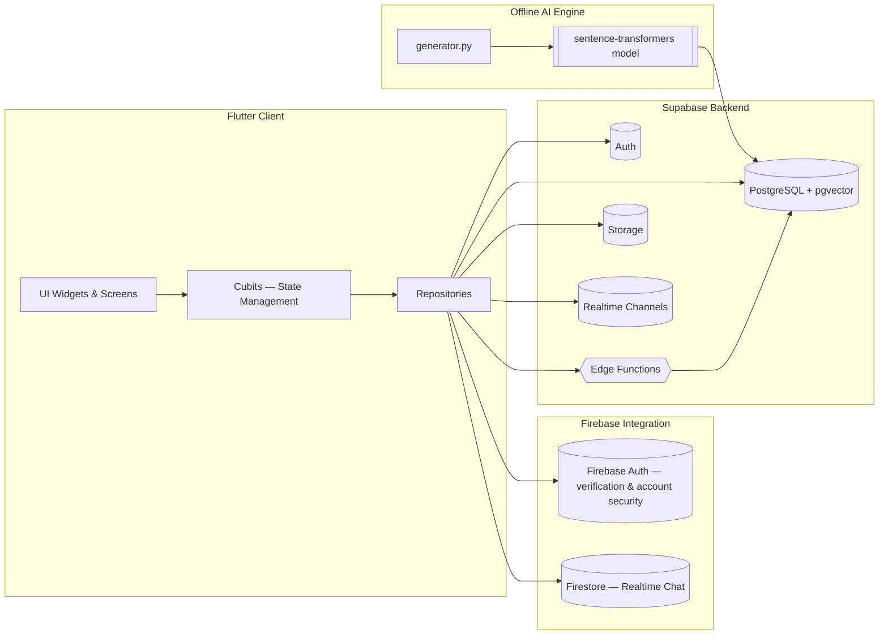

# System Architecture

[← Back to README](../README.md)

---

## 1. Design Methodology & Justification

Basma 360° was built using a **hybrid approach**: **Agile methodology** for project management, combined with **Feature-Based MVVM** on the client and a **serverless backend** design.

### Why Agile over Waterfall or Spiral

The project involved evolving requirements — most notably, AI-based matching was expanded significantly beyond its original scope based on iterative development and feedback during the analysis phase. Agile's 2-week, time-boxed sprints (e.g., authentication in one sprint, opportunities in the next) allowed for quick prototypes and adjustments, which a linear Waterfall process would not have accommodated.

- **Trade-off:** Agile can be prone to scope creep. This was mitigated through time-boxed sprints and regular self-review (daily stand-ups in a solo development process).
- **Spiral** methodology was considered for its risk-management emphasis but rejected as excessive overhead for a prototype-scale academic project.

### Why MVVM over MVC on the client

- **Models** handle data (e.g., `OpportunityModel`)
- **Views** manage UI (e.g., `opportunity_details_screen.dart`)
- **ViewModels**, implemented via **Bloc/Cubit**, control logic and state

This separation improves testability and maintainability compared to traditional MVC, where controllers tend to become bloated as an app grows.

### Why Supabase (serverless) over a custom backend

A serverless approach using Supabase was chosen over a custom Node.js server for its scalability and reduced maintenance burden.

- **Trade-off:** introduces a dependency on a third-party vendor. This was balanced by Supabase's open-source nature and its tight integration with Flutter via `supabase_flutter`.

---

## 2. High-Level Architecture

The architecture is **client–server** based: Flutter is the client, Supabase is the backend. Data flows from UI widgets → Cubits (Bloc state management) → repositories → Supabase. Realtime features (such as chat) use dedicated channels for live updates.



### Key components

- **Client Layer** — Flutter app, organized by feature in `lib/features/` (auth, profiles, opportunities, chat, etc.)
- **Backend Layer** — Supabase tables (`volunteers`, `opportunities`, etc.) and Edge Functions (e.g. `match-opportunities` for AI matching, `geocode-location` for location resolution)
- **AI Integration** — an offline Python generator (`generator.py`) populates vector embeddings, which are queried through SQL-based similarity functions
- **Firebase Integration** — used alongside Supabase Auth for email verification and account-security operations, and for the Firestore-based realtime chat system

---

## 3. Client-Side Folder Structure

```
lib/
├── core/
│   ├── constants/
│   ├── di/                     # Dependency injection (GetIt) — registers Cubits & repositories
│   ├── enums/
│   ├── errors/                 # failures.dart — maps exceptions to user-friendly messages
│   ├── helpers/
│   ├── localization/
│   ├── networking/
│   ├── routing/
│   ├── shared_widgets/
│   ├── theme/
│   └── validators/
│
└── features/
    ├── auth/
    ├── bottom_nav_bar/
    ├── chat/
    ├── community/
    ├── home/
    ├── location/
    ├── organization_verification/
    ├── posts_opportunity/
    ├── profile/
    ├── setting/
    └── skill_test/
```

Root files: `main.dart`, `basma360_app.dart`, `auth_wrapper.dart`, `firebase_options.dart`

---

## 4. Backend Structure

```
backend/
└── embeddings/
    ├── generator.py            # Offline embeddings generator
    ├── requirements.txt
    └── .env

supabase/
├── functions/
│   ├── geocode-location/
│   ├── match-opportunities/
│   └── send-verification-success-email/
└── config.toml
```

- **`generator.py`** loads the `paraphrase-multilingual-MiniLM-L12-v2` sentence-transformer model, fetches volunteers and opportunities from Supabase, generates embeddings (field+bio, bio-only, and description embeddings), and writes them back to the database.
- **`match-opportunities`** is a Deno/TypeScript Edge Function that calls the `match_opportunities_for_volunteer` PostgreSQL RPC (using the Supabase service role key for full access), enriches the results with skill and organization data, and returns a ranked list of opportunities to the client.
- **`geocode-location`** converts a user-provided location into precise latitude/longitude coordinates, used both for opportunity posting and volunteer location setup.

Dependency injection (via **GetIt**) registers Cubits and repositories throughout the client app. Key packages: `supabase_flutter`, `flutter_bloc`, `freezed`, and `sentence_transformers` (Python side).

---

## 5. Database Access Pattern

Repositories communicate with Supabase primarily through:

- Standard table queries, e.g. `supabase.from('volunteers').select()`, with joins to related tables (applications, history)
- Targeted updates, e.g. `supabase.from('volunteers').update({...}).eq('id', userId)`, to avoid overwriting unrelated fields
- RPC calls for computation-heavy logic (matching scores), keeping business logic close to the data for performance and consistency

For full table structure and relationships, see **[`DATABASE_SCHEMA.md`](DATABASE_SCHEMA.md)**.
For the matching pipeline itself, see **[`AI_MATCHING.md`](AI_MATCHING.md)**.
