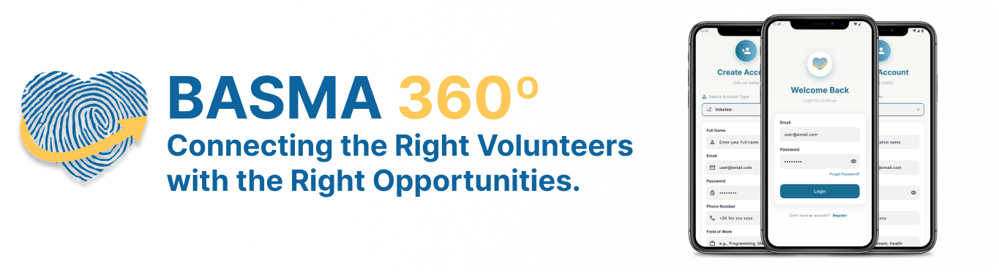
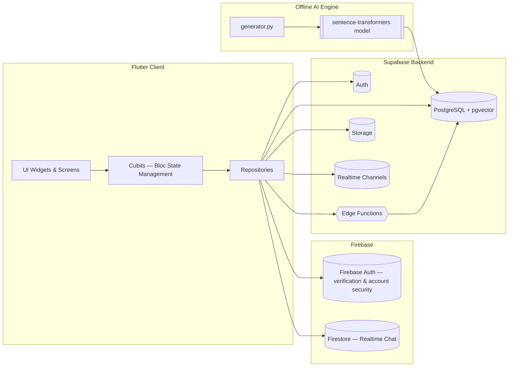
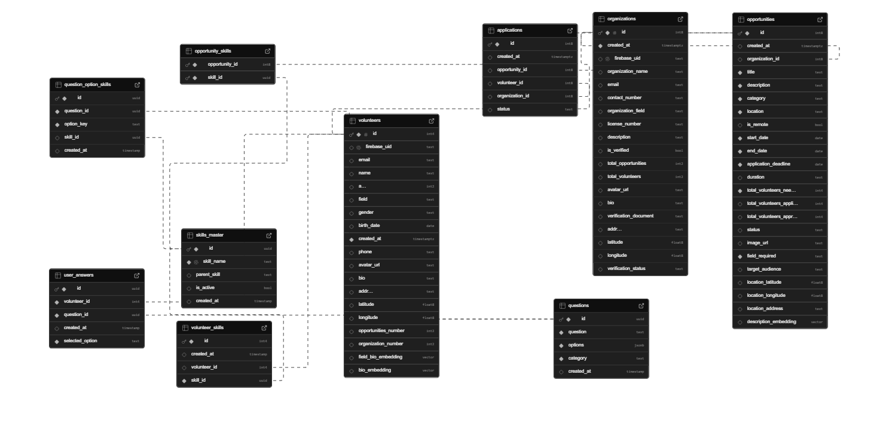

<div align="center">


# Basma 360° | AI-Powered Volunteering Platform

**Connecting the right volunteers with the right opportunities.**



[](#-technology-stack)
[](#-technology-stack)
[](#-technology-stack)
[](#-technology-stack)
[](#-technology-stack)
[](#-technology-stack)


</div>

---

> 📌 **About this repository**
> This is a **portfolio / showcase repository** for Basma 360°. The application's source code is private and closed-source; what follows is in-depth documentation of the problem, system design, architecture, and engineering decisions behind the project — written for recruiters, engineers, and reviewers.

---

## 📖 Table of Contents

- [Project Overview](#-project-overview)
- [Problem Statement](#-problem-statement)
- [Objectives](#-objectives)
- [Key Features](#-key-features)
- [AI-Powered Matching Engine](#-ai-powered-matching-engine)
- [System Architecture](#-system-architecture)
- [Database Design](#-database-design)
- [Technology Stack](#-technology-stack)
- [Testing & Results](#-testing--results)
- [Engineering Challenges](#-engineering-challenges)
- [Future Work](#-future-work)
- [Project Information](#-project-information)
- [Contact](#-contact)

---

## 📖 Project Overview

**Basma 360° (Volunteer Connect)** is a mobile platform that bridges the coordination gap between volunteers and charitable organizations. It is built with **Flutter**, backed by **Supabase** (PostgreSQL database, authentication, realtime features, storage, and edge functions), with **Firebase** used for email verification, account security, and realtime chat.

The platform allows charitable organizations to post verified volunteering opportunities, while volunteers can browse, filter, and apply to opportunities that are automatically ranked for them. At the core of the system is a **hybrid AI matching engine** that combines rule-based logic (skills, location, gender/target-audience constraints) with **semantic similarity search** over vector embeddings, generated offline via a Python script and queried through PostgreSQL using the `pgvector` extension.

The project began as an academic final-year capstone with a conservative scope, but was iteratively expanded — using Agile-style sprints — to include a full AI matching pipeline, realtime chat, and a skills assessment system that were not part of the original plan.

> 🔒 The source code for this project is private. This repository exists to document the system for portfolio purposes.

---

## 🛑 Problem Statement

Volunteering plays a vital role in helping charitable organizations serve their communities, but a persistent coordination gap limits its impact:

- **Charities struggle to find the right volunteers.** Smaller or resource-constrained organizations often can't recruit volunteers with the specific skills or availability their initiatives need (e.g., a literacy program needing tutors with teaching experience), leading to understaffed projects.
- **Volunteers struggle to find the right opportunities.** Relevant opportunities are scattered across fragmented sources — social media, outdated websites, flyers — making it hard for people to find opportunities matching their skills, interests, and availability. Some organizations report up to **40% fewer volunteer engagements** than needed because of these barriers.
- **Trust is hard to establish.** Volunteers hesitate to commit to organizations they can't verify are legitimate.
- **Self-reported skills are unreliable.** Without structured assessment, volunteer-opportunity matches based purely on self-declared skills tend to be weak.
- **Coordination happens off-platform.** Without in-app communication, volunteers and organizations fall back on inefficient external channels.

**Basma 360° addresses each of these gaps directly:**

| Problem | Solution |
|---|---|
| Organizations are hard to verify | Organizations must upload official verification documents before they can post opportunities |
| Self-reported skills are unreliable | A structured Skills Assessment Test evaluates competencies and feeds results directly into the matching engine |
| No direct communication channel | A realtime chat feature (Firebase Firestore) enables secure, context-based communication after an application is made |
| Manual searching is inefficient | A multi-stage AI matching pipeline ranks opportunities by skill overlap, location proximity, and semantic similarity |

---

## 🎯 Objectives

- Design an intuitive mobile interface for volunteers to browse and filter opportunities by skills, interests, and availability.
- Enable organizations to post detailed volunteer needs (required skills, schedules) to attract suitable candidates.
- Implement a matching algorithm that aligns volunteer profiles with organization requirements for effective pairings.
- Verify organizations to increase trust and platform safety.
- Enable smooth, direct, realtime communication between volunteers and organizations.
- Support diverse volunteering fields and opportunities across different locations.
- Improve accessibility through location-aware recommendations.
- Ensure the app is accessible and inclusive, with support for multiple languages and diverse user needs.
- Evaluate usability and performance through structured user testing, targeting a ≥85% satisfaction rate.

---

## ✨ Key Features

| Feature | Summary |
|---|---|
| 🔐 **Role-Based Authentication** | Separate registration/login flows for Volunteers and Organizations, with dynamic UI routing based on user role. Email verification handled via Firebase. |
| 🧾 **Rich Profiles** | Volunteers manage bio, skills, skills-test results, application history, and volunteering history. Organizations manage verification status and contact details. |
| 📋 **Opportunity Management** | Organizations create, edit, and close opportunities with title, description, category, required skills, dates, location (or remote), image, and volunteer capacity. |
| 🧠 **Hybrid AI Matching** | Opportunities are ranked per-volunteer using a weighted combination of skill overlap, location proximity, gender/audience constraints, and semantic (AI) similarity. See [AI-Powered Matching Engine](#-ai-powered-matching-engine). |
| 🧪 **Skills Assessment Test** | A structured test infers volunteer skills objectively; results generate embeddings that feed directly into the AI matching pipeline. |
| 💬 **Realtime Chat** | Firebase Firestore-powered chat, restricted to context-based entry points (after an application exists) and enforced via Firestore security rules. |
| ✅ **Organization Verification** | Organizations upload verification documents; only verified organizations can post opportunities. A verification badge builds volunteer trust. |
| 📍 **Location Awareness** | Mandatory location setup after registration via a geocoding edge function, used for distance-based matching and recommendations. |
| ⚙️ **Account & Settings** | Theme switching (light/dark), language display, and Firebase-secured account actions (change password, delete account with re-authentication, logout). |

Full implementation details — including the exact Cubits, repositories, and design rationale behind each feature — are documented in **[`docs/FEATURES.md`](docs/FEATURES.md)**.

---

## 🧠 AI-Powered Matching Engine

Rather than relying on a single signal, Basma 360° evaluates **multiple independent dimensions of compatibility** for every volunteer–opportunity pair, then combines them into one ranking score. All scoring is executed at the database level via **PostgreSQL stored functions** for performance and consistency.

**Pipeline:**
1. Retrieve volunteer data (skills, gender, location, embeddings)
2. Retrieve opportunity data (required skills, location, target audience, description embedding)
3. Compute each partial score (skills, location, gender, AI semantic similarity)
4. Normalize all scores to a 0–100 scale
5. Combine scores using weighted aggregation into a final ranking score

**Final Matching Formula:**

```
Total Match Score = 0.40 × Skills Match
                   + 0.15 × Location Match
                   + 0.05 × Gender Match
                   + 0.25 × AI Field + Bio Similarity
                   + 0.15 × AI Bio Similarity
```

- **Skills Match** — percentage overlap between an opportunity's required skills and the volunteer's stored skills.
- **Location Match** — 100% if the opportunity is remote; otherwise calculated via the **Haversine formula** and mapped to a distance-based score (≤10 km → 100%, down to >200 km → 0%).
- **Gender Match** — binary constraint based on the opportunity's target audience.
- **AI Semantic Similarity** — cosine similarity between volunteer embeddings (field+bio, and bio-only) and the opportunity's description embedding, computed via the `pgvector` extension.

Embeddings are generated **offline** using a Python script (`generator.py`) with the `sentence-transformers` model **`paraphrase-multilingual-MiniLM-L12-v2`**, then batch-written to Supabase. Matching is served through a Supabase Edge Function that calls a PostgreSQL RPC (`match_opportunities_for_volunteer`), which returns a ranked, enriched list of opportunities per volunteer.

Full formulas, worked examples, and SQL/TypeScript snippets are documented in **[`docs/AI_MATCHING.md`](docs/AI_MATCHING.md)**.

---

## 🏗 System Architecture

Basma 360° follows a **client–server architecture**: Flutter as the client, Supabase as the primary backend, with Firebase handling authentication extras and realtime chat.



**Design methodology:** The project combines **Agile** (2-week sprints, iterative feature delivery) with a **Feature-Based MVVM** pattern on the client (Cubits acting as ViewModels) and a **serverless backend** via Supabase — chosen over a custom Node.js server for scalability and reduced maintenance overhead.

**Client-side folder structure (`lib/`):**

```
lib/
├── core/            # constants, DI, enums, errors, helpers, localization,
│                     networking, routing, shared_widgets, theme, validators
└── features/
    ├── auth
    ├── bottom_nav_bar
    ├── chat
    ├── community
    ├── home
    ├── location
    ├── organization_verification
    ├── posts_opportunity
    ├── profile
    ├── setting
    └── skill_test
```

**Backend (`supabase/functions/`):** `geocode-location`, `match-opportunities`, `send-verification-success-email`
**AI Engine (`backend/embeddings/`):** `generator.py`, `requirements.txt`

Full architectural rationale, trade-offs (Agile vs. Waterfall/Spiral, MVVM vs. MVC, Supabase vs. custom backend), and component breakdown are documented in **[`docs/ARCHITECTURE.md`](docs/ARCHITECTURE.md)**.

---

## 🗄 Database Design

The database is **PostgreSQL**, hosted on Supabase, and normalized to minimize redundancy while supporting efficient matching and realtime queries.

**Core tables:** `volunteers`, `organizations`, `opportunities`, `applications`, `skills_master`, `opportunity_skills`, `questions`, `question_option_skills`, `user_answers`, `volunteer_skills`

**Key relationships:**
- One-to-many: `organizations` → `opportunities`
- Many-to-many: `opportunities` ↔ `volunteers` (via `applications`); `opportunities` ↔ `skills` (via `opportunity_skills`)

Vector columns (e.g. `description_embedding`, `bio_embedding`, `field_bio_embedding`) enable semantic search via the **`pgvector`** extension. Matching logic is exposed through two SQL functions: `get_volunteer_match_score` (single pair, used for debugging/validation) and `match_opportunities_for_volunteer` (ranked list for a given volunteer).

Full schema, field-level detail, and the entity-relationship diagram are documented in **[`docs/DATABASE_SCHEMA.md`](docs/DATABASE_SCHEMA.md)**.

<div align="center">

</div>

---

## 🛠 Technology Stack

| Layer | Technology |
|---|---|
| **Client** | Flutter (Dart) — cross-platform mobile |
| **State Management** | BLoC (Cubit) |
| **Architecture** | Feature-Based MVVM |
| **Backend** | Supabase (client-server, serverless) |
| **Database** | PostgreSQL + `pgvector` |
| **Auth & Security Extras** | Firebase Authentication (email verification, password/account operations) |
| **Realtime Chat** | Firebase Firestore |
| **AI / Embeddings** | Python + `sentence-transformers` (`paraphrase-multilingual-MiniLM-L12-v2`) |
| **Edge Functions** | Supabase Edge Functions (Deno/TypeScript) |
| **Key Flutter packages** | `supabase_flutter`, `flutter_bloc`, `freezed`, `geolocator`, `geocoding` |

---

## 🧪 Testing & Results

**Testing approach:**
- **Functional testing** — unit tests on core Cubits (e.g. login success/failure, invalid input) plus integration testing of Supabase interactions across related tables.
- **User Acceptance Testing (UAT)** — evaluated by a simulated group of volunteers and organizations.
- **Usability evaluation** — assessed against established usability heuristics (clarity, feedback, error prevention).
- **Security testing** — validation of Row-Level Security (RLS) policies and unauthorized-access prevention.
- **Test calibration** — mock data used throughout to simulate realistic profiles, opportunities, and chat interactions without touching production data.

**Results:**

| Area | Result |
|---|---|
| Registration & email verification | Avg. registration time under 1 minute; 100% success rate for email verification |
| Profile loading | Loaded in under 2 seconds from Supabase tables |
| AI matching relevance | 75–85% relevance in controlled/mock tests, outperforming purely rule-based matching |
| Skills Assessment Test | 95% completion rate in testing |
| Realtime chat | Message updates delivered in under 1 second |
| Usability (UAT, 12 participants) | Average satisfaction of **4.6 / 5** — exceeding the ≥85% target — with core tasks (register, post, browse, apply) completed unassisted in under 45 seconds on average |

**Goals achieved beyond original scope:** Realtime chat, organization verification, and the skills assessment test were all initially considered stretch goals — all three were fully implemented and validated as part of the delivered prototype.

---

## 🧩 Engineering Challenges

- **Fine-grained Row-Level Security (RLS):** Designing RLS policies in Supabase for role-based access (e.g., restricting who can view profiles/applications) required carefully balancing security against query performance.
- **Hybrid Firebase + Supabase integration:** Combining Firebase (auth extras, chat) with Supabase (primary backend) required custom UID mapping between the two systems and careful handling to avoid sync delays, since there was no native bridge between them.

Both challenges were addressed through iterative testing, documentation review, and mock-data validation — a practical example of working across two different backend ecosystems within a single application.

---

## 🚀 Future Work

- **Push Notifications** — via Firebase Cloud Messaging (or Supabase realtime + native notifications) for new high-match opportunities, application status changes, and incoming messages.
- **Community Hub** — a dedicated space for discussion posts, success stories, and event announcements beyond one-to-one chat.
- **Gamification & Recognition** — achievement badges (e.g. "First Opportunity Completed") and a points-based reward system.
- **Organization Analytics Dashboard** — insights into application trends, volunteer demographics, and match performance.
- **Full Multilingual & Offline Support** — complete Arabic localization and offline caching of opportunity listings.
- **Advanced AI Refinements** — periodic retraining of the embedding model on platform-generated data, and incorporating availability scheduling into the matching algorithm.
- **Admin Dashboard** — for reviewing organization verification requests and managing reports.
- **Volunteer Certificates** — automatic generation of digital certificates for completed opportunities.
- **AI-Assisted Applicant Screening** — ranking applicants using organization-defined custom questions.


---

## 📬 Contact

🔗 [All My Links](https://linktr.ee/alaa.elsaidy)

Questions and feedback are always welcome.

---

## 📄 License

This project is proprietary and confidential. All rights reserved. This repository is provided strictly as a portfolio showcase — the underlying source code is not publicly available.
